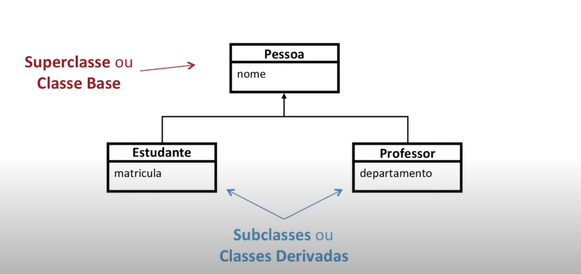

# Herança

Tecninca para reutilizar características de uma classe na definição de outra classe

Determinação de uma hierarquia de classes, terminologia relacionadas à Herança:
* Classe mais genérica: Superclasse Pai
* Classe especializadas: Subclasse Filha

Os atributos e metodos são herdados por todos os objetos dos niveis mais baixos. Já os protegidos e publics podem.
Considerando o modificador de acesso.  Membros private são "Herdados" mas não são acessíveis pois pertencem apenas ao escopo da classe.
Diferentes subclasses podem herdar as caracteristicas de uma ou mais superclasse.

Beneficios: 
* Reutilização de código.
* Preservar as diferenças
* Facilita manutenção
* Codigo menor e mais legivel.
* Multipla superclasse.

<center></center>

Exemplo: 
```c++
class Pessoa { // Classe Pai.
    public:  
        string nome;
};

class Estudante : public pessoa { // Classe estudante herda de pessoa
    public: 
        int matricula.
}
```
Repare naquele *public* antes da classe base. Ess modificador de acesso pode ser usado para: 

* como *Public*: Mantém os níveis de acesso da classe base.
* como *Protected*: Mantém os niveis de acesso publica e protected da classe base como **protected** na classe filha.
* como *Private*: Mantém os niveis de acesso publica e protected da classe base como **private** na classe filha.

O mais comum é manter como publica.

Exemplo de como utilizar: 

```c++
class Pessoa { // Classe Pai.
    public:  
        string nome;
};

class Estudante : public pessoa { // Classe estudante herda de pessoa
    public: 
        int matricula.
};

class EstGrad : public Estudante {
    public: 
        string curso;
};
```

main: 
```c++
int main() {
    EstGrad* aluno = new EstGrad();

    aluno->nome = "Joao";
    aluno->matricula = 2019123456;
    aluno->curso = "Computação";

    return 0;
}
```

#### Construtores e Destrutores 

A classe derivada executa o construtor da classe base ANTES de executar o próprio
* Chamado mesmo que implicitamente (padrão).
* Pode estar explícita na lista de inicialização

A classe derivada executa o destrutor da classe base depois de executar o próprio:

Exemplo: 

```c++
class A {
    public: 
        A() { cout << "A()" << endl; }
        ~A() { cout << "~A()" << endl; }
};

class B : public A {
    public: 
        B() { cout << "B()" << endl; }
        ~B() { cout << "~B()" << endl; }
};

class C : public B {
    public: 
        C() { cout << "C()" << endl; }
        ~C() { cout << "~C()" << endl; }
};
```
output:..

    Alocando B:
    A()
    B()

    Alocando C:
    A()
    B()
    C()

    Deleting C:
    ~C()
    ~B()
    ~A()

    Quiting...
    ~B()
    ~A()


Chamando o construtor para inicializar um parametro na classe filha: 

```c++
class A {
    int _a;
    public: 
        A(int a): _a() {};
        void getAtributo() { cout << _a << endl; };
};

class B: public A {
    int _b;
    public: 
        B(int a, int b): A(a), _b(b) {};
};
```

chamado na main:
```c++
int main() {
    A objA(55);

    B objB(77, 99);
    objB.getAtributo();

    return 0;
}
```


### Herança Simples **Sobrescrita de métodos**:

#### Métodos podem ser sobrescritos (overriding)
* Mesm assinatura e tipo de retorno
* Métodos privados não são sobrescritos
* Devem ser definidos como 'Virtuais'
* sobrescrito (quando um metodo é redefinido para uma mesm assinatura) <> Sobrecarregado (quando existe diferentes assinaturas de um método)

* Não restringir oo acesso ()
    * Metodos public -> se tornam public
    * Metodos protected -> se tornam protected ou public

Atributos não podem ser redefinidos, Se atribuo do mesmo nome for definido na
subclasse, a definição na superclasse é <u>ocultada</u>

Membros estáticos: Não são redefinidos, mas ocultados. Como o acesso é feito pelo nome da classe, estar ou não ocultado terá pouco efeito.

#### Métodos Virtuais 

Resolvidos dinamicamente, apenas em tempo de execução sabemos exatamente qual função será camada. 
O Comportamento base de uma classe pode ser sobrescrito em classes derivadas.

exemplo: 

```c++
class Pessoa {
    public:
        virtual void meuNome() {
            cout << "Meu nome é PESSOA." << endl;
        }
};

class Estudante : public Pessoa {
    public: 
        void meuNome() override {
            cout << "Meu nome é ESTUDANTE" << endl;
        }
};

```

chamada no main: 
```c++
int main() {
    Pessoa p;
    p.meuNome(); // "Meu nome é PESSOA"
    
    Estudante e;
    e.meuNome(); // "Meu nome é ESTUDANTE"

    Pessoa* p2 = new Estudante();
    p2->meuNome(); //"Meu nome é ESTUDANTE"

    delete p2;
    return 0;
}
```

## Herança Multipla

Subclasse herda de mais de uma superclasse. Infelizmente isso tem alguns pontos ruins, como: 
* Dificultar a manutenção do sistema
* Também dificulta o entendimento
* Reduz a modularização (Super objetos)
* Pode gerar ambiguidade

Exemplo: 

```c++ 
class Animal {
    
};

class Herbivoro: public Animal {

};

class Carnivoro: public Animal {

};

class Onivoro: public Herbivoro, public Carnivoro {

};
```

Auxilia em>
* Reuso: Escreva código em Comum uma vez apenas
* Extensão: Adicione novas responsabilidades (membros)
* Especialização Redefina Responsabilidades existentes: Classe Base -> Classe Derivada