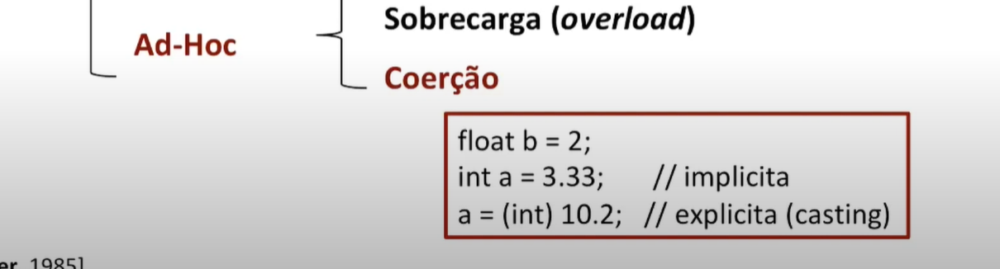

# Polimorfismo

Vem do grego Poli Morphos (Muitas formas)

Em OO: 
 * É a habilidade de um objeto assumir múltiplas formas
 * Em herança, subclasses podem assumir o comportamente da superclasse ou redefinir um método herdado


 ### Tipos de Polimorfirsmo: 
 <center></center>

 ## Polimorfismo Universal
 Universal ou verdadeiro:
 * Capacidade de uma única função (único código) poder ser usado com
 mais do que um tipo
 * Os tipos nesse caso tem uma estrutura comum 
 * Operam sobre uma quantidade potencialmente infinita de tipos


 ## Polimorfismo Ad-Hoc:

No adhoc ou Aparente: Quando uma função executa código diferentes (tem comportamentos diferentes) para cada tipo de parâmetro

Numero finito de tipos diferentes e potencialmentes não relacionados

Não precisa de uma estrutura comum entre as classes para o polimorfismo acontecer;

## Polimorfismo Universal -> Parametrico

Métodos genéricos que trabalham de forma uniforme
para vários tipos

Torna a linguagem mais expressiva
    * Templates em C++ ( Genérics em Java)

* Parametrico -> Implicito:
    * Os tipos são identificados pelo compilador
* Paramétrico -> Explicito:
    * Os tipos são passados como parâmetro

## Polimorfismo Universal -> Inclusão (Subtipagem)

Problemas resolvidos pelo polimorfismo de inclusão: 

<center></center>

Como resolver ?

Programação voltada a tipos abstratos

Possibilidade de um tipo abstrato ( classe abstrata ou interface) ser utilizado sem que se conheça a implementação correta
* Independência de implementação
* Maior foco na interface (fronteira, contrato)

Como resolver o problema do método FALE ?
* Sobrescrita (especialização)! 

```c++
class Animal {
    public: virtual void fale() {
        cout << "Fale Padrão" << endl;
    };
};

class Cachorro: public Animal {
    public: void fale() override {
        cout << "Au! Au!" << endl;
    };
};


class Gato: public Animal {
    public: void fale() override {
        cout << "Miau" << endl;
    };
};
```
Uso no main: 

```c++ 
int main() {
    Cachorro c;
    c.fale();

    Gato g;
    g.fale();

    return 0;
}
```

Outra forma: 
```c++ 
int main() {
    Animal* c = new Cachorro();
    c->fale();

    Animal* g = new Gato();
    g->fale();

    delete c;
    delete g;

    return 0;
}
```
# 8.33

Como o compilador "Sabe" a qual classe o objeto pertence ?

* Ligação Tardia (Late/Dynamic Binding)
    * As decisões são feitas durante a execução
    * É a chave para o funcionamento do polimorfismo

* C++: Padrão é ligação Prematura 
    * Ligação tardia utiliza o comando "virtual" 

Modela Subtipos e Herança
    * Redefinição em classes descendentes

Onde um objeto de um determinado tipo for esperado um do subtipo deve ser aceito.
    * Principio da substituição de Liskov
    * O contrário nem sempre é válido!


<center></center>

exemplo em código: 

```c++ 
#include <list>

int main() {
    list<Animal*> lista;

    for(int i=0; i <5; i++) {
        if(i%2==0) {
            lista.push_back(new Cachorro());
        } else {
            lista.push_back(new Gato());
        }
    }
    for (auto a: lista)
        a->fale();
    
    return 0;
}
```

Animal deveria ser uma abstract class  e 
Pato, Gato e Cachorro deveriam implementar ela.

```c++
class Animal {
    public: 
        virtual void fale() = 0; // Não possui implementação nenhuma
};

class Gato : public Animal {
    public: 
        void fale() override {
            cout << "Miau!" << endl;
        };
};

class Cachorro : public Animal {
    public: 
        void fale() override {
            cout << "Au! Au!" << endl;
        };
};
```
finalizando: 

<center></center>

<br><hr><br>

<center></center>