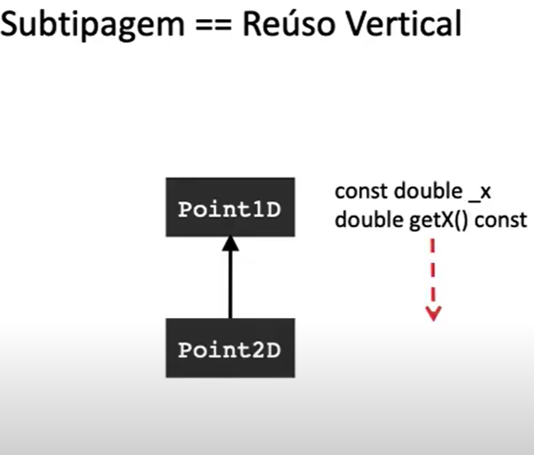

# Polimorfismo Paramétrico

É um recurso de reutilização de codigo, muito comum nas linguagens de programação
é o polimorfismo paramêtrico, no Java é conhecido como Generics.


Vamos ver um exemplo de reuso. 

* Exemplo 1: 

```c++
    char get_max(char a, char b) {
        return (a>b ? a : b);
    }
```

Bom, *a in {-128 ... 127}* e *b in {-128 .. 127}*

* a = 256 possibilidades
* b = 256 possibilidades

* **get_max**(a, b) = 512 Possibilidades


redifinido para usar inteiros: 

```c++
    char get_max(char a, char b) {
        return (a>b ? a : b);
    }

    int get_max(int a, int b) {
        return (a>b ? a : b);
    }
```


Bom, *a in {-2^31 ... 2^31}* e *b in {-2^31 ... 2^31}*

* a = 2^32 possibilidades
* b = 2^32 possibilidades

* **get_max**(a, b) = 2^64 Possibilidades


Podemos redefinir para strings também 

```c++
    char get_max(char a, char b) {
        return (a>b ? a : b);
    }

    int get_max(int a, int b) {
        return (a>b ? a : b);
    }

    string get_max(string a, string b) {
        return (a>b ? a : b);
    }
```


podemos perceber um comportamento padrão, para toda operação que seja possivel de se comparar.

```c++
??? get_max(??? a, (??? b) {
    return (a>b ? a : b);
}
```

Para isso temos os templates que nos permitem reutilizar o codigo para parametros de tipos diferentes: 

```c++

template <class T>
T get_max(T a, T b) {
    return (a > b  ? a : b);
}

int main () {
    int i = 5, j=6, k;
    k = get_max<int>(i,j);
    long l = 10, m = 5, n;
    n = get_max<long>(l, m);
    string q = "Ah", r= "eh", s;
    s = get_max<string>(q,r);
    return 0
}

// as vezes o compilador reconhece o paramentro, e não precisamos passar <string> por exemplo
```
 
## O contrato do Tipo: 

Vejamos o codigo a seguir: 

```c++
# include <iostream>

using namespace std;

struct Interval {
    int x, y;
};

template <class T> T get_max(T a, T b) {
    return (a>b?a:b)
}

int main () {
    Interval i0, i1;
    i0.x = 1;
    i0.y = 10;
    i1.x = 2;
    i1.y = 4;
    Interval i2 = get_max<Interval>(i0, i1);
    cout << i2.x << endl.
    return 0;
}
```

O codigo acima vai gerar um erro BEM extenso pois  a função **get_max** não tem nenhuma operação para lidar com o Tipo INTERVAL, ou seja, ela não sabe comparar Interval < Interval. 

Nesse o que podemos fazer é definir a operação de **>** para o Struct Interval 

```c++

#include <iostream>

using namespace std;

struct Interval {
    int x, y;
    bool operator > (const Interval &i1) {
        return x < i1.x && y > i1.y;
    }
}

template <class T> T get_max(T a, T b) {
    return (a>b?a:b);
}

```

Além disso podemos utilizar outra tecnica que se chama: **Especialização de Templates**
que consiste em construir um definição para um tipo especifico de classe: 

```c++
template <class T> 
T get_max(T a, T b) {
    return (a>b?a:b);
}

template <> Interval 
get_max<Interval>(Interval a, Interval b) {
    Interval i;
    i.x = a.x > b.x ? a.x : b.x;
    i.y = a.y > b.y ? a.y : b.y;
    return i;
}
```

<hr>

## PARTE II

Vamos ver um exemplo: 

### Ordernar numeros em um arquivo de Texto: 
Escreva um programa que leia inteiros de um arquivo e os imprimas ordenados.

Nosso programa consiste em: 

1. Leitura dos dados
2. Ordenação dos dados
3. Impressão dos resultados 

<br>

**1. Leitura dos dados**

```c++
std::vector<int> data;
int val = 0;
while (std::cii) >> val {
    data.push_back(val);
}
```

**2. Ordenação dos dados**
```c++
std::sort(data.begin(), data.end());

```


**3. Impressão dos resultados**
```c++
for (int elem: data) {
    std::cout << elem << " ";
}
std::cout << std::endl;

```

full code: 

```c++
#include <vector>
#include <iostream>
#include <algorithm>

int main() {

    std::vector<int> data;
    int val = 0;
    while (std::cii) >> val {
        data.push_back(val);
    }
    std::sort(data.begin(), data.end());
    for (int elem: data) {
        std::cout << elem << " ";
    }
    std::cout << std::endl;
}
```
Chamada: 
```sh
$ clang++ vect_int.cpp
$ echo "3 5 1 2 3" > in.txt
$ ./a.out < in.txt 

# 1 2 3 4 5
```


Vamos mudar o comportamento do código: 

### Ordernar numeros em um arquivo de Texto: 
Escreva um programa que leia STRINGS de um arquivo e os imprimas ordenados.

código: 

```c++
#include <vector>
#include <iostream>
#include <algorithm>

int main() {

    std::vector<string> data;
    string val = 0;
    while (std::cii) >> val {
        data.push_back(val);
    }
    std::sort(data.begin(), data.end());
    for (int elem: data) {
        std::cout << elem << " ";
    }
    std::cout << std::endl;
}
```

Então podemos perceber um esqueleto comum e utilizar o polimorfismo para simplificar o uso: 

```c++ 
#include <vector>
#include <iostream>
#include <algorithm>

template <class T> void readNSort() {
    std::vector<T> data;
    T val = 0;
    while (std::cii) >> val {
        data.push_back(val);
    }
    std::sort(data.begin(), data.end());
    for (int elem: data) {
        std::cout << elem << " ";
    }
    std::cout << std::endl;
}

int main () {
    readNSort<float>();
    // readNSort<string>();
    // readNSort<int>();
}

```

Agora temos mais uma pergunta, quals propriedades o **readNSort** deve ter ?

por exemplo, se o tipo **T** fosse o struct S definido a seguir ?:
```c++
struct S {
    int x, y;
};
```

Algumas operações não poderiam ocorrer já que não foram definidas para o tipo S, como por exemplo: 

 1. **<<**
 2. **std::sort**
 3. **>>**

Vamos aprender a definilos a seguir: 


### Ordenando Numeros

Escrea uma função que recebe uma lista não vazia de valores, e retorne a soma dos valores armazenados na lista 

```c++
template <class T>
T getFirst(std::deque<T> &data) {
    T first = data.front();
    data.pop_front();
    return first;
}
```

```c++
template <class T>
T sumList(std::deque<T> &data) {
    if (data.empty()) `{
        throw "Error: Empty List";
    } else {
        T sum = getFirst(data);
        for (T elem:data)  {
            sum += elem;
        }  
        return sum;
    }
}
```

e agora ficamos com a pergunta, qual tipo **T** pode ser ?

> int, double, string ....

mas e se T fosse do tipo S ?
```c++
struct S {
    int x, y;
};
```

T precisa ter um tipo *somavel*, mas podemos definir os operadores **+=**

```c++
struct S {
    int x, y;
    S& operator += (const S &obj) {
        x = obj.x + x;
        y = obj.y + y;
        return *this;
    }
};
```

mass, se mudarmos a função sumList, temos alguns probleminhas: 


```c++
template <class T>
T sumList(std::deque<T> &data) {
    if (data.empty()) `{
        throw "Error: Empty List";
    } else {
        T sum = getFirst(data);
        for (T elem:data)  {
            sum = sum + elem;
        }  
        return sum;
    }
}
```

Agora, o tipo **S** não pode substituir **T**. MAs podemos implementar a soma: 

```c++
struct S {
    int x, y;
    S& operator += (const S &obj) {
        x = obj.x + x;
        y = obj.y + y;
        return *this;
    }
    S operator + (const S &obj) {
        S res;
        res.x = obj.x + x;
        res.y = obj.y + y;
        return res;
    }
};
```

Todo tipo que sabe lidar com o operador SUM LIST pode ser passado


<hr>

# Templates parametrizados por valores

#### Arranjos Seguros
Implemente uma classe BoundArray que represente arranjos cujo tamanho seja conhecido em tempo de compilação, e que verifique se os acessos ao arranjo são seguros. 


Por exemplo: 
```c++
int main (int argc, char** argv) {
    int A[2] = {0, 0};
    A[argv] = 0; // argv poderia ser 123,,25125,12312 qualquer coisa. 
}
```


Para isso podemos agir da seguinte maneira:
 
```c++
template <class T, int N>
class BoundedArray {
    T memblock[N];
    public:
        void set(int x, T value);
        T get(int x);
} 


template <class T, int N>
void BoundedArray<T,N>::set(int x, T value) {
    assert(x >= 0 && x < N); // Faz com que o programa termine se a condição for falsa
    memblock[x]=value;
}

template <class T, int N>
T BoundedArray<T,N>::get(int x) {
    assert(x >= 0 && x < N); // Faz com que o programa termine se a condição for falsa
    return memblock[x];
}
```

```c++
int main () {
    BoundedArray<int, 5> myints;
    BoundedArray<float, 5> myfloats;
    myints.set(0, 100);
    myfloats.set(10, 3.1416);
    cout << myints.get(0) << '\n';
    cout << myfloats.get(3) << '\n';
    return 0;
}

```

### Tempo de Compilação

Os valores passados para definirem um array devem ser conhecidos em tempo de compilação, por exemplo: 

```c++
int main () {
    for(int i = 0; i < 100; i++) {
        BoundedArray <int,i> myints;
        myints.set(0,100);
        count << myints.get(0) << '\n';
    }
    return 0; 
}
```

Nota: 
Não é possivel codificar  um arquivo separado para a declaração e a definição de uma classe Template, por exemplo: 

<u>BoundedArray.h</u>

```c++
#ifndef BOUNDED_ARRAY_H
#define BOUNDED_ARRAY_H
template BoundedArray {
    T memblock [N];
    public: 
        void set (int x, T value);
        T get(int x);
};
#endif
```
<u>BoundedArray.cpp</u>
```c++ 
#include <iostream>
#include <assert.h>
#include "BoundedArray.h"

using namespace std;

template <class T, int N>
void BoundedArray<T,N>::set(int x, T value) {
    assert(x >= 0 && x < N); // Faz com que o programa termine se a condição for falsa
    memblock[x]=value;
}

template <class T, int N>
T BoundedArray<T,N>::get(int x) {
    assert(x >= 0 && x < N); // Faz com que o programa termine se a condição for falsa
    return memblock[x];
}

```

O codigo acima não iria compilar, para resolver o problema, podemos fazer uma simples gambiarra: 

```c++
#ifndef BOUNDED_ARRAY_H
#define BOUNDED_ARRAY_H
template BoundedArray {
    T memblock [N];
    public: 
        void set (int x, T value);
        T get(int x);
};

#include "BoudedArray.cpp"
#endif
```


# DRY - Dont repeat yourself

* Eliminar redundancias 
* Melhorar a manutenção
* Aumentar a eficiência do programa
* Aumentar eficiência do programador


* Algumas formas reutilizar codigos é importar bibliotecas
* Fatorar código comum.
* Polimorfismo Universaç => Infinitos Tipos: 
    * Subtipagem => *Reuso Vertical*
    * Paramétrico ( Templates ) => *Reuso Horizontal*

### **Subtipagem == Reuso Vertical**

```c++
class Point1D {
    const double _x;
    public: 
        Point1D(const double x): _x(x) {}
        double getX() const {return _x;}
        virtual double norm() const {
            return _x;
        }
};


Class Point 2D: public Point1D {
    const double _y;
    public: 
        Point2D(const double x, const double y): 
        Point1D(x), _y(y) {}
        double getY() const {return _y;}
        virtual double norm() const {
            return sqrt(getX()* getX()  + _y*_y);
        }
}
```



### **Polimorfismo paramétrico == Reuso Horizontal**

```c++
class Point1D {
    const double _x;
    public: 
        Point1D(const double x): _x(x) {}
        double getX() const {return _x;}
        virtual double norm() const {
            return _x;
        }
        bool operator > (const Point1D& p) const {
            return this->norm() > p.norm();
        }
};

template <class T>
T* GetMax(T* a, T* b) {
    return *a > *b ? a : b;
}

```
