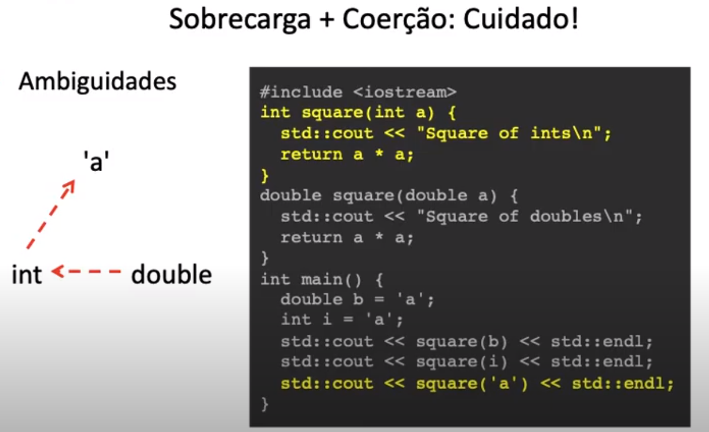

# Polimorfismo de Sobrecarga ( Parte I )

Existem 2 tipos de polimorfismo:

1.Universal ( o mesmo nome pode ter uma quantidade infinitas de Tipos )
    
* Subtipagem
* Paramétrico

2.Ad-Hoc ( o mesmo nome pode ter uma quantidade finitas de Tipos )

* Coerção (está presente quando temos um tipo modificado para interagir com outro tipo)
    Exemplo: int x = 1 + 3.14, forçamos 1 agir como double, 1.0

* Sobrecarga


## Sobrecarga: 

Operador ou função com Assinaturas diferentes. 

Lembrando que a assinatura de um método é composta por seu tipoe seu nome, por exemplo: 

* \+ : int x int 

* \+ : double x double

* \+ : string x string 




Temos que ter cuidado quando misturamos coerção e sobrecarga. 

No exemplo acima, o codigo compila, mas o retorno é o da função Square para int, pois
a coerção acontece primeiro de char para int, depois de int para double. Então é parado no inicio da coerção. 


> OBS: Cada função sobrecarregada quando compilada para assembly, possui um nome diferente

O polimorfismo ad-hoc, é mais ou menos um polimorfismo, pois no final das contas o compilador escreve uma função para cada tipagem.

## Sobrecarga de operadores.

É a capacidade que uma linguagem tem de possibilitar reasignar funçãos para operadores, como por exemplo: 

*, -, *, /, << ...

A sobrecarga de operadores em C++ é interessante pois permite  a melhor utilização de templates: 


exemplo: 
```c++
#include <vector>
#include <iostream>
#include <algorithm>
template <class T> void readNSort() {
    std::vector<T> data;
    T val; 
    while (std::cin >> val) {
        data.push_back(val);
    }
    std::sort(data.begin(), data.end());
    for (T elem: data) {
        std::cout << elem << " ";
    }
    std::cout << std::endl;
}

```

O tipo T precisa lidar com as seguintes operações: 
* \>> 
* <<
* < (para comparação)

Por exemplo, o tipo Fraction, não poderia ser utilizado: 
```c++
#ifndef DATA_H
#define DATA_H
struct Fraction {
    int num, den;
}
#endif
```

Vamos definir **>>** na fraction: 

<u>fraction.h</u>

```c++
#ifndef DATA_H
#define DATA_H
struct Fraction {
    int  num, den;
};

std::istream& operator >> (std::istream& is, Fractio& dt);
#endif
```


<u>fraction.cpp</u>

```c++
#include <iostream>
#include "fraction.h"

std::istream& operator >> (std::istream& is, Fractio& dt) {
    is >> dt.num >>  dt.den;
    return is;
}

```

<u>main.cpp</u>

```c++
#include <iostream>
#include "fraction.h"

int main( ) {
    Fraction f;
    std::cin >> f;
}

```


### Criando operações de Escritas de Streams 


<u>fraction.h</u>

```c++
#ifndef DATA_H
#define DATA_H
struct Fraction {
    int  num, den;
};

std::istream& operator >> (std::istream& is, Fractio& dt);
std::ostream& operator << (std::ostream& out, Fractio const& f);
#endif
```


<u>fraction.cpp</u>

```c++
#include <iostream>
#include "fraction.h"

std::istream& operator >> (std::istream& is, Fractio& dt) {
    is >> dt.num >>  dt.den;
    return is;
}
std::ostream& operator << (std::ostream& out, Fractio const& f) {
    return out << "(" << f.num << "/" << f.dem << ")";
}

```

<u>main.cpp</u>

```c++
#include <iostream>
#include "fraction.h"

int main( ) {
    Fraction f;
    std::cin >> f;
    std::cout << f;
}

```


### Criando operações de comparações;

<u>fraction.h</u>

```c++
#ifndef DATA_H
#define DATA_H
struct Fraction {
    int  num, den;
    // Inline indica que sempre que possivel
    // adicionar o corpo da função onde o operador é chamado.
    inline bool operator < (const Fraction& f) const {
        const double commonDen = den * f.den;
        return (num * f.den)/commonDen < (f.num * den) / commonDen;
    }
    // inline exemplo: Reduz o custo de chamada de funções
    /* 
        bool a = f0 < f1;

        //faz com que: 

        bool a;
        {const double commondDen = f0.den * f1.den;
         bool x0 = (f0.num * f1.den) / commonDen < (f1.num* f0.den) / commonDen;
         a = x0;}
    */

    // Podemos definir as outras operações apenas reutilizando
    inline bool operator > (const Fraction& f) const {
        return f < *this;
    }
    
    inline bool operator <= (const Fraction& f) const {
        return !(*this > f);
    }
    
    inline bool operator >= (const Fraction& f) const {
        return !(*this < f);
    }
};

std::istream& operator >> (std::istream& is, Fractio& dt);
std::ostream& operator << (std::ostream& out, Fractio const& f);
#endif
```


<u>fraction.cpp</u>

```c++
#include <iostream>
#include "fraction.h"

std::istream& operator >> (std::istream& is, Fractio& dt) {
    is >> dt.num >>  dt.den;
    return is;
}
std::ostream& operator << (std::ostream& out, Fractio const& f) {
    return out << "(" << f.num << "/" << f.dem << ")";
}

```

<u>main.cpp</u>

```c++
#include <iostream>
#include "fraction.h"

int main( ) {
    Fraction f;
    std::cin >> f;
    std::cout << f;
}

```


## Conversões 

por exemplo: 

```c++
template <class T>
T sum(std::vector<T>& data) {
    T sum = 0; // Necessário
    for (T val: data) {
        sum += val; // Necessário
    }
    return sim;
}
```
Vimos que o tipo **T** precisa de 2 operações;
1. \+=
2. \=


No caso da Fraction que fizemos anteriormente, não existe operação de atribuição.
Então o código abaixo não iria funcionar (não compila): 

```c++ 
int main() {
    Fraction f = 0;
    return 0
}
```

Para resolver, poderiamos simplesmente fazer o seguinte: 

```c++
struct Fraction {
    int  num, den;
    Fraction(int n=0, int d=1): num(n), den(d) {}
    Fraction(int n): num(n), den(1) {}
    Fraction(): num(0), den(1) {}
}
```
e assim podemos fazer: 
```c++
int main () {
    Fraction f0, f1 = 0, f2(3,4);
    return 0
}

```

Vamos agora adicionar uma simplificação de frações: 
```c++

struct Fraction {
    int num, den;
    Fraction(int n=0, int d=1) {
        int div = gcd(n, d);
        num = n/div;
        den = d/div;
    }
    ...
    private: 
        int gcd(int x, int y);

}
```

```c++
int Fraction::gcd(int x, int y) {
    if (y==0) {
        return x;
    } else {
        if ( y > x) {
            return gcd(y, x);
        } else {
            int r = x / y;
            return gcd(y, x - r*Y);
        }
    }
}
```

Depois de termos implementado o construtor, permitimos atribuir um tipo primitivo a **Fraction**. 

Mas também podemos fazer o contrário e permitir que um tipo primitivo receba Fraction:

```c++
    int main() {
        Fraction f = 0;
        int i = f;
        float ft = f;
        double db = f;
        bool b = f;
        return 0;
    }
```

para isso podemos simplismente implementar: 

```c++

struct Fraction {
    int num, den;
    Fraction(int n=0, int d=1) {
        int div = gcd(n, d);
        num = n/div;
        den = d/div;
    }
    
    operator int() const {return num/den;}
    operator float() const {return num/(float)den;}
    operator double() const {return num/(double)den;}
    operator bool() const {return num != 0; }
    private: 
        int gcd(int x, int y);

}
```


Agora ficou faltando apenas a operação de SOMA da Fraction: 


```c++

struct Fraction {
    int num, den;
    Fraction(int n=0, int d=1) {
        int div = gcd(n, d);
        num = n/div;
        den = d/div;
    }
    Fraction& operator += (const Fractions& f) {
        int newDen = den * f.den;
        int newNum = num * f.den + f.num * den;
        den = newDen;
        num = newNum;
        return *this;

    }
    operator int() const {return num/den;}
    operator float() const {return num/(float)den;}
    operator double() const {return num/(double)den;}
    operator bool() const {return num != 0; }
    private: 
        int gcd(int x, int y);

}
```


## Polimorfismo de sobrecarga VS Polimorfismo paramétricos: 

<u>Polimorfismo de sobrecarga</u>
```c++

int sum(int a,  int b) {
    returnn a + b;
}

double sum(double a, double b) {
    return a + b;
}
```
* Finitas funções
* mesma funções com implementações diferentes

<br>

<u>Polimorfismo paramétricos</u>
```c++

template <class T>
T sum(T a, T b) {
    return a + b;
}
```
* Infinitas funções
* funções com mesmas implementações


A sobrecarga de Operadores aumenta o poder da linguagem

Por exemplo: 

<u>Sem Sobrecarga de Operadores</u>
```c++
int main () {
    Fraction f0(0,1);
    Fraction f1;
    std::cint >> f1.num >> f1.den;
    Fraction f2 = f0.add(f1);
    if (f2) {
        f2.num = 1;
        f2.den = 1;
    }
    std::cout << f2.toString();
    return 0;
}
```


<u>Com Sobrecarga de Operadores</u>

<span> performa como tipos primitivos </span>
```c++
int main () {
    Fraction f0 = 1;
    Fraction f1;
    std::cint >> f1;
    Fraction f2 = f0 + f1;
    if (f2) {
        f2 = 1;
    }
    std::cout << f2;
    return 0;
}
```


<h3 style="color:red">Operadores que não podem ser sobrescritos:  </h3>

* O operador de ponto **.** 
    * x.m();
* O operador de quatro pontos **::** 
    * x::m();
* Ponteiros para atributos
    * x.*m;
* Expressão condicional
    * x ? y : z
    

Java e JS não permiter a sobrecarga de Operadores.
## CUIDADO COM A COMPLEXIDADE DA SOBRESCRITA 