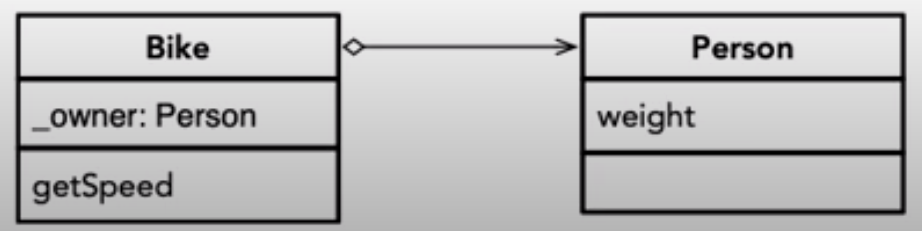

# Estudo de Composição e Herança.

Vamos responder a uma duvida inicialmente, 
algo **Concreto = Imutável ?**

e outra **Imutável = Re-trabalho ?**

Software uma vez pronto é algo concreto, ele é algo que podemos utilizar para algum fim. Mas temos tentencia a ver que algo concreto é imutavel, no geral queremos poder alterar softwares para reutilizar. Um software que nunca munda acaba requerindo reescrever codigo, já que ele é  inflexivel.

Não chamamos Copiar e colar como reutilizar..

Um sistema de de software que pode ser reusado sem que seu codigo esteja disponivel e dito princípio da abertura - fechamento. 

Dizemos que ele é:
* Aberto para extensão: 
    * Novos Campos
    * Novas operações
    * Novas invariantes
* Fechado para uso: 
    * Interface bem definidas
    * precondições
    * pos condições
    * compilados para ser parte de um programa maior.


Em geral a herançaé uma forma que a linguagem de programalçai tem de possibilitar a adequação do software ao princípio de abertura-fechamento.

A herança permite algo Concreto e Flexivel em outras palavras reutilizavel.

Por exemplo, veja o código a seguir: 

```c++ 
template <class T, unsigned N>
class Buffer { 
    T buf[N];
    public: 
        void write(T e, unsigned i) {
            assert(i >= 0 && i < N);
            buf[i] = e;
        }
        T read(unsigned i) {
            assert(i >= 0 && i < N);
            return  buf[i];
        }
        void start() {std::cout << "&> "; }
        void stop() {std::cout << std::endl; }
        void eval(T& e) { std::cout << e << std::endl; }
        void process() {
            start();
            for (int i=0; i < N; i++) {
                eval(buf[i]);
            }
            stop();
        }
};
```

Esse código acima é muito inflexivel pois já é algo completo e pronto para uso. 

Mas podemos criar uma nova classe a partir dela, para poder reutilizar algumas operações e redefinir outras, como: 


Chamamos isso de Arcabolso (framework)

```c++ 
template <class T, unsigned N>
class BufferAdder: public Buffer<T, N> { 
    T sum;
    public: 
        void start() {
            sum = 0;
        }
        void stop() {}
        void eval(T& e) {
            sum += e;
        }
        T getSum() const {
            return sum;
        }
}
```
Com isso conseguimos: 
1. Adicionar uma nova funcionalidade
2. Refinir uma funcionalidade já existente 
3. Adicionar uma nova propriedade invariante

**MAS**  Observe que o codigo acima não executaria, pois não é possivel sobrescrever os métodos *start(), stop() e eval()* pois na classe pai eles não foram definidos como
virtuais (possiveis de serem rescritos).

Para isso, podemos pensar em tornar a classe Buffer como uma classe abstrata. Ou seja
uma classe apenas com as declarações dos métodos mas sem definição. Para isso é manter o método sem corpo.

Com a classe abstrata é muito mais dificil quebrar o principio de Linskov com elas, pois os metodos abstratos não impõem contratos sobre seus clientes.


```c++ 
template <class T, unsigned N>
class Buffer { 
    T buf[N];
    public: 
        virtual ~Buffer() {}  // Abstrato
        void write(T e, unsigned i) {
            assert(i >= 0 && i < N);
            buf[i] = e;
        }
        T read(unsigned i) {
            assert(i >= 0 && i < N);
            return  buf[i];
        }
        virtual void start() = 0;  // Abstrato
        virtual void stop() = 0;  // Abstrato
        virtual void eval(T& e) = 0;  // Abstrato
        void process() {
            start();
            for (int i=0; i < N; i++) {
                eval(buf[i]);
            }
            stop();
        }
};
```


## Composição

O software é como um quebra cabeça em que vamos juntando as partes. 

Temos alguns tipos de blocos que nos ajudam na construção de um software como por exemplo: 

* Herança: 
    Quando uma classa herda de outra. 
* Associação
    * Agregação: Quando uma classe é agregada a outra, mas **sem dependecia**:
    Por exemplo a classe Bicicleta é associada à classe Pessoa, mas uma pessoa pode viver sem uma bicicleta e a bicicleta pode existir sem um dono.  Usada como o **diamente branco** no diagrama de classe.

    * Composição: Quando uma classe é agregada a outra, mas **com dependecia**:
    Por exemplo a classe Nome é associada à classe Pessoa, mas a classe nome não pode existir sem um dono.  Usada como o **diamente Negro** no diagrama de classe.


#### Agregação



#### Composição: 


A composição obriga que: A entidade proprietária precisa apagar a entidade possuida, quando ela não for mais necessária. 

```c++
    virtual ~Bike() {
        delete _owner;
    }
```


## HERANÇA

Vamos demostrar um exemplo mais prático da Herança e construir o seguinte diagrama: 


```c++
class Movable { // Classe abstrata
    public: 
        virtual ~Movible() {}
        virtual double getSpeed() const = 0; // COmo não ter corpo definido faz com que a classe seja abstrata
} 

class Vehicle: public Movable { // Classe abstrata
    public: 
        Vehicle(unsigned p): _num_passangers(p) {}
        virtual ~Vehicle() {}
        virtual double getSpeed() const = 0; // COmo não ter corpo definido faz com que a classe seja abstrata
        int getNumPassangers() const {
            return _num_passangers;
        }
    private: 
        unsigned _num_passangers;
};

class Bus: public Vehicle {
    public:
        Bus(unsigned p): Vehicle(p) {}
        double getSpeed() const {
            return 120.0 + (
                32.0 / getNumPassangers()
            );
        }
};

class Bike: public Vehicle {
    public:
        Bike(): Vehicle(1) {}
        double getSpeed() const {
            return 50.0;
        }
};

int main () {
    Movable *m0 = new Bus(20);
    Movable *m1 = new Bike();
    Vehicle *v0 = new Bus(30);
    Vehicle *v1 = new Bike();

    Bus *bus = new Bus(30);
    Bike *bike = new Bike();
}

```

## Agregação


## Relações: 

A relação de **Herança** é definida de **"É um"**.

A relação de **Associação** é definida de **Possuí um**

Assim teriamos: 

```c++
class Bike {
    Person *_owner;
    public: 
        Bike(Person *o): _owner(o) {}
}
```
para agregação

e 

```c++
class Bike {
    Person *_owner;
    public: 
        Bike(Person *o): {
            _owner = new Person();
        }
        ~ Bike() {
            delete _owner;
        }
}
```


Para definir **interfaces** em C++ construimos classes abstratas, ou seja classes com métodos sem corpo definido

Bom, vamos tentar modelar aquele relacionamento de veiculos de uma forma um pouco diferente: 

#### COmponentes Essenciais: 

O que temos de caracteristicas essencial em um veículo ?

* Veiculo: 
    * Móvel 
    * Passageiros

Agora, vamos deifinir esses 2 conjuntos de caracteristicas (movel, passageiros) como
interfaces essenciais: 

```c++
class MovableFeatures {
    public:
        virtual ~MovableFeatures() {}
        virtual double getSpeed() const = 0;
};

class PassengerFeatures {
    public:
        virtual ~PassengerFeatures() {}
        virtual unsigned getNumPassengers() const = 0;
};

```

e volto a ressaltar: 
> Para definir **interfaces** em C++ construimos classes abstratas, ou seja classes com métodos sem corpo definido

e como vamos definir um veiculo a partir disso ?

Exemplo **RUIM**:
```c++
class Vehicle {
    public:
        Vehicle(MovableFeatures *f, PassengerFeatures *p):
            _mf(f), _pf(p) {}
        virtual ~Vehicle() {
            delete _pf;
            delete _mf;
        }
        MovableFeatures *getMF() {
            return _mf;
        }
        PassengerFeatures *getPF() {
           return _pf;
        }
    private:
        MovableFeatures* _mf;
        PassengerFeatures* _pf;
};

```
Esse exemplo acima é ruim pois cria uma composição, sem difinir um Tipo para vehicle.

Ou seja, Vehicle só se define como um vehicle e perde a capacidade de "**É um ...**"

Vamos corrigir isso : 

```c++
class Vehicle: public MovableFeatures, PassengerFeatures {
    public:
        Vehicle(MovableFeatures *f, PassengerFeatures *p):
            _mf(f), _pf(p) {}
        virtual ~Vehicle() {
            delete _pf;
            delete _mf;
        }  
        virtual double getSpeed() const {
           return _mf->getSpeed();
        }
        unsigned getNumPassengers() const {
            return _pf->getNumPassangers();
        }
    private:
        MovableFeatures* _mf;
        PassengerFeatures* _pf;
};

```


Aqui podemos ver que se renomearmos, temos que 
Vehicle implementa os metodos de Movable e PassangeContainer, logo possui suas caracteristicas e pode também ser considerado como um movable e um PassangerContainer.

#### Veiculos Concretos. 


Vamos condensar um pouco mais o nosso contexto para mostrar alguns conceitos de instanciação interessantes: 


Tome o diagrama acima como o código que construimos.

### BUilder

Para criar instancias de objetos mais complexos, podemos criar funções que pode nos auxiliar: 

por exemplo: 

```c++
Vehicle* buildBus(unsigned passengers, double speed) {
    PassengerContainer *pf = new FixedSeat(passangers);
    Movable *mf = new VariableSpeed(speed, pf);
    return new Vehicle(mf, pf);
}

Vehicle* buildBike(double speed) {
    return new Vehicle(new FixedSpeed(speed),  new SingleSeat());
}

```

e por fim chamar tudo no main: 

```
int main() {
    Vehicle* bus = buildBus(20, 120.0);
    Vehicle* bike = buildBike(50.0);
    return 0;
}
```