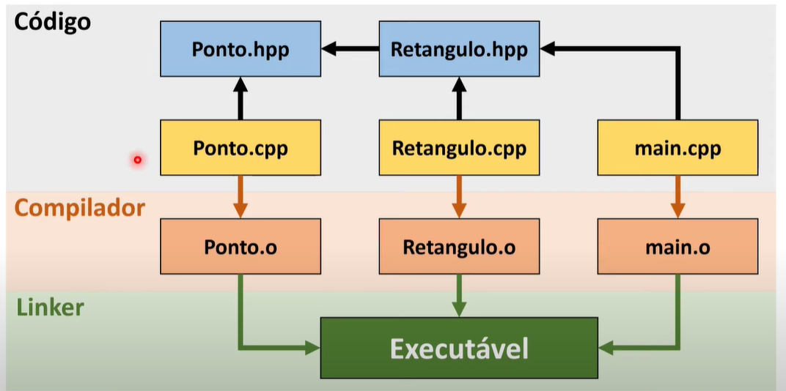

## Modulariazação de código: 

Classes já vem com o papel organizado de ser modularizado. Mas só vem organizado localmente. Mas essa estruturações ainda tem seus problemas...Por exemplos: O principio da responsabilidade unica, essas classes representam apenas partes de conceitos gerais.

Em Sistemas grandes e complexos temos que pensar melhor na estruturação do código... 

Como por exemplo: 


Pense em manutenção e em erros que podem acontecer devido a alguma abstração muito grande como no exemplo cima.


Vamos estabelecer alguns lemas que podem nos ajudar: 

> "Agrupar para Consquistar"

Na programação modular, temos algumas tecnicas para colocar elementos que se interrelacionam juntos, isso aumenta a compreenção e a manutenção.

como por exemplo a seguinte agrupação: 


## Conceito de **Módulo**

* Para propósito único
* Interface apropriada com outrso módulos
* Pode ser compilada separadamente
* Reutilizável e modificáveis


O módulo deve ser estruturados para que possam ser desenvolvidos e compilados separadamentes. É a base para comportamento de reutilização.

Começamos a nos perguntar: ***Quais Classes dfeveriam ser agrupadas ?***
* Classes de mesma hierarquia deveriam estar em um mesmo módulo
* Classes relacionadas por composição ("tem um") deveria estar em um mesmo módulo.
* Classes com muita Colaboração (trabalham juntas para um mesmo propósito.)

### Medidas de Agrupamentos de módulos> 

* Coesão: 
    * Grau de dependência entre os elementos internos ao módulo
    * Funções, responsabilidades (com o mesmo objetivo)
    * Uma baixa coesão indica que os elementos não estão muito bem definidos no sistema, e isso implica em uma baixa reutilização do sistema

* Acomplamento:
    * Define o grau de dependência entre 2 módulos distintos.
    * Alteração em um, demanda alteração em outro
    * Um alto acoplamento dificulta a manutenção do software


> Durante o desenvolvimento: <**Mais coesão**> <**Menos acomplamento**>

<!-- > Durante o desenvolvimento: <**Mais coesão**> <**Menos acomplamento**> -->

Geralmente nenhum programa muito grande são escritos do zero, geralmente usam de algumas bibliotemas para facilitar o desenvolvimento.


### Reutilização: 

* Biblioteca: 
    É um conjunto de implementações já completas como subprogramas e funções que podem ser importadas no seu código. É uma coleção organizada de funcionalidades uteis.

* Framework:
    É um esqueleto de uma aplicação que requer que você termine de construir a aplicação em algum momento.


## Modularização II 

em C++ Namespaces é o que chamamos de **Região declarativa** é um delimitador abstrato que fornece um contexto para os tipos que ele apresenta, assim os namespaces são utilizados para organizar o codigo em grupos logicos e evitar colisão de nomes.


Permitem uma desambiguação para referencias com o mesmo nome.
Por exemplo o **STD**


Em outras linguas: 
Java:Packages; Python: Modules; C++20:Modules


Exemplo namespaces: 

<small>Obs: eles podem até mesmo estar no mesmo arquivo e até mesmo um mesmo namespace pode ser declarado em diversos arquivos, ainda assim fazendo parte do mesmo módulo e tendo o mesmo escopo</small>

```c++
namespace Modulo1 {
    class ClassA {
        public:
            ClasseA() {
                std::cout << "Modulo1::ClasseA" << std::endl
            } 

    };
}

namespace Modulo2 {
        public:
            ClasseA() {
                std::cout << "Modulo1::ClasseA" << std::endl
            } 

    };
}

```


Para acionar o namespace que desejamos devemos utilizar diretamente o nome pelo prefixo.

```c++
int main () {
    Modulo1::ClasseA c1;
    Modulo2::ClasseA c2;
    return 0;
}
```

Também podemos colocar tudo do namespace no escopo atual, como por exemplo: 
`c++ using namespace std`


Como já foi dito antes, não é obrigatório que um mesmo módulo esteja no mesmo arquivo, por isso poderiamos ter o seguinte código que adiciona uma nova classe ao **módulo B**

```c++
namespace Modulo1 {
    class ClassB {
        public: 
            ClassB() {
                std::cout << "Modulo1::ClasseB" << std::endl;
            }
    }
}
```

A modularização ajuda a compilação.

Em um sitema grande, temos muitos arquivos com varias pessoas trabalhando em cada parte.
Para isso não é convêniente recompiçar todo o programa para testar apenas um módulo. 

Lembrando que os usuários deve conhecer apenas o TAD da classe. 


###  Especificação (Interface) X Implementação
* classe.hpp:
    * Contém a especificação das funções e tipos de dados
    * Parte conhecida/importada por outros módulos.
    * Não precisa de muita alteração
* classe.cpp
    * Contém a implementação das funções.
    * Ao mudar a implementação, somente esse arquivo é recompilado.

* Bibliotecas: 
    * Compila uma vez, use várias.


O compilador faz o seguinte processo para o código. 

Chamamos os arquivos .O como arquivos objects, que estão sem a referência de bibliotecas externas ou arquivos separados.



### Compilação:

* Compilar e Ligar as referências: 
```sh 
$ g++ -o Executavel arquiv01.cpp arquivo2.cpp
```


* Compilar apenas: 
```sh 
$ g++ -c arquivo.cpp -> aquivo.o
```


* Ligar referência apenas: 
```sh 
$ g++ -o Executavel aquivo1.o arquivo2.o
```

Essa separação de compilação e ligação das referencias que permitem a programação modular.

<hr> 

## Os Makefiles

Os aquivos MAKEFILE são como um roteiro para a compilação, são usados como entradas para um comando chamado Make. 


* Contem uma lista de requisitos para que um programa seja considerado *'Up Tp Date'* ( versão mais recente do código). O programa `make` examina todos esses requisitos, verifca os timestamps em todos os arquivos listados no makefile e recompila apenas os arquivos com um registro desatualizado.


Os makefiles contém atribuiçoes de variáveis, comentários e regras (targets)
* Informa as dependências entre os arquivos, indica os comandos necessários para a compilação.


```makefile
# Variáveis auxiliares
CC=g++ 
CFLAGS=-std=c++11 - Wall 

# Targets
all: main

# compilando os arquivos Ponto.
Ponto.o: Ponto.hpp Ponto.cpp
	${CC} ${CFLAGS} - c Ponto.cpp

# Compilando o aquivo ponto e main.cp
main.o: Ponto.hpp main.cpp
	${CC} ${CFLAGS} -c main.cpp

# Fazendo a ligação dos aquivos O.
main: main.o Ponto.o
	${CC} ${CFLAGS} -o main main.o Ponto.o

## Target to clear the files generated on the compilation
clean:
	rm -f main *.o
```

Chamada: 
```sh 
$ make

# g++ -std=c__11 -Wall -c main.cpp
# g++ -std=c__11 -Wall -c Ponto.cpp
# g++ -std=c__11 -Wall -c main main.o Ponto.o

$ ./main

# Fiz uma alteração apenas no arquivo Ponto.cpp
make
# g++ -std=c__11 -Wall -c Ponto.cpp
# g++ -std=c__11 -Wall -c main main.o Ponto.o
# Apenas os arquivos com alterações são feitas.
```


## Organização dos arquivos dentro dos projetos.


Podemos seguir seprações por diretorios, como por exemplo os seguinte: 


Vamos à um exemplo... Considere o projeto a seguir: 


*<u>./include/automovel/Carro.hpp</u>*
```c++
#ifndef CARRO_H
#define CARRO_H

namespace Carro {
    class CarroAbstrato {
        public: 
            virtual void start() = 0;
            virtual void drive() = 0;
            virtual void stop() = 0;
    };
}

#endif
```

*<u>./include/automovel/Ferrari.hpp</u>*
```c++
#ifndef CARRO_H
#define CARRO_H

#include "Carro.hpp"

namespace Carro {
    class Ferrari: public CarroAbstrato {
        public: 
            virtual void start() = 0;
            virtual void drive() = 0;
            virtual void stop() = 0;
    };
}
#endif
```


*<u>./include/automovel/Ford.hpp</u>*
```c++
#ifndef CARRO_H
#define CARRO_H

#include "Carro.hpp"

namespace Carro {
    class Ford: public CarroAbstrato {
        public: 
            virtual void start() = 0;
            virtual void drive() = 0;
            virtual void stop() = 0;
    };
}
#endif
```


Observe que na implementação pode se omitir o diretório dos arquivos ***.hpp*** durante a inclusão, especificando a implementação: 

*<u>./include/automovel/Ford.hpp</u>*
```c++
    #include <iostream>
    #include "Ferrari.hpp"  // Omitimos o diretório.

    void Carro::Ferrari::start() {
        std::cout << "Starting a Ferrari\n"
    }

    void Carro::Ferrari::drive() {
        std::cout << "Driving a Ferrari\n"
    }

    void Carro::Ferrari::stop() {
        std::cout << "Stopping a Ferrari\n"
    }
```


*<u>./src/main.cpp</u>*
```c++

#include "Ford.hpp" // importamos apenas as definições dos contrátos
#include "Ferrari.hpp" // importamos apenas as definições dos contrátos

int main() {
    Carro::Ferrari ferrari;
    ferrari.start();
    ferrari.drive();
    ferrari.stop();

    Carro::Ford ford;
    ferrari.start();
    ferrari.drive();
    ferrari.stop();

}
```

Agora vamos ver o Makefile desse projeto: 

```makefile
CC=g++
CFLAGS=-std=c++11 -Wall
TARGET=program

BUILD_DIR = ./build
SRC_DIR = ./src
INCLUDE_DIR = ./include

${BUILD_DIR}/${TARGET}: ${BUILD_DIR}/Ferrari.o ${BUILD_DIR}/Ford.o ${BUILD_DIR}/main.o ${CC} ${CFLAGS} -o ${BUILD_DIR}/${TARGET} ${BUILD_DIR}/*.o


${BUILD_DIR}/Ferrari.o: ${INCLUDE_DIR}/automovel/Ferrari.hpp ${SRC_DIR}/automovel/Ferari.cpp ${CC} ${CFLAGS} -I ${INCLUDE_DIR}/automovel -c ${SRC_DIR}/automovel/Ferrari.cpp -o ${BUILD_DIR}/Ferrari.o

${BUILD_DIR}/Ford.o: ${INCLUDE_DIR}/automovel/Ford.hpp ${SRC_DIR}/automovel/Ford.cpp ${CC} ${CFLAGS} -I ${INCLUDE_DIR}/automovel -c ${SRC_DIR}/automovel/Ford.cpp -o ${BUILD_DIR}/Ford.o

${BUILD_DIR}/main.o: ${INCLUDE_DIR}/automovel/Ferrari.hpp ${INCLUDE_DIR}/automovel/Ford.hpp ${SRC_DIR}/main.cpp ${CC} ${CFLAGS} -I ${INCLUDE_DIR}/automovel -c ${SRC_DIR}/main.cpp -o ${BUILD_DIR}/main.o

# Rule for cleaning files generated during compilation
# Call 'make clean' to use it

clean: 
    rm -f ${BUILD_DIR}/*

```


Refs:

https://cs.colby.edu/maxwell/courses/tutorials/maketutor/

https://dev.to/mendoza/how-to-write-a-good-makefile-for-c-32e3

https://www3.ntu.edu.sg/home/ehchua/programming/cpp/gcc_make.html