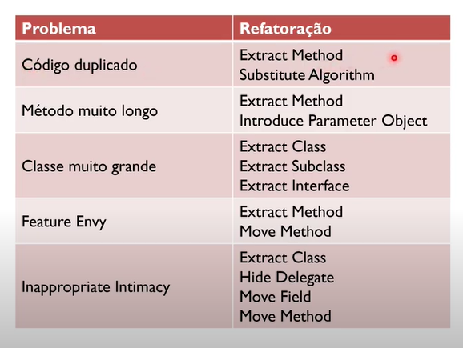

## Revisão de Código

Uma revisão de código é uma tarefa construtiva de rever o código e a documentação antes que ele seja de fato integrado com o código prinicipaoi do programa e por meios disso identificar erros de interpretação, incoerências, falhas e etc... 

Geralmente feita por um membro mais experiente na equipe.

* Aumenta a taxa de detecção de erros 
* Dimnui a taxa de  erros 

Quem faz a correção e quem corrige são pessoas diferentes.

Proposito:
* Melhorar o Código
* Melhorar o Desenvolvedor

Existe um padrão de verificação usado na revisão de código: 
* Códgio Legivel
* Adere à Guidelines
* Identação
* Sem numeros mágicos
* Nomenclatura
* unidades e limites
* Espaçamento Horizontal e vertical.

 

# Revisão de código <> Refatoração.

## Refatorações 

Por mais que revisão de código e refatoração sejam fatores que visam o aprimoramento do codigo são conceitos diferenntes

Refatoração é o processo de reescrever algum material para melhorar sua estutura de maneira geral.

Refatorações visa modificações (geralmente pequenas) que não altera o comportamento funcional, mas que melhora as qualidades não funcionais. (Visa: Facilidade de compreensão, ajuda a encontrar erros, ajuda a programar mais rapidamente)

Refatoração é um preceito básico na Extreme Programming (XP)

O conceito de Refatoração é coisas relacionados ao Design (Code) Smells:
* Caracteristicas (odores) que são perceptiveis em softwares de má qualidade (podres)

* Rigidz, Fragilidade, Imobilidade, Viscosidade, Complexidade, Repetição, Opacidade.

Refatoração visa encontrar esses Bad Smells e corrigilos. 

Refatoração não é uma reeestruturação arbitraria: 
* Codigo ainda deve funcionar
* Pequenas mudanças e não reescreverr tudo
* Resultado: Reutilizavel, legivel, testavel
* (Alta coesão / Baixo Acoplamento)

 
 
 

> Quando fazer uma Refatoração ?

* Quando Fazer:
    * Encontrou um "Bad Smell"
    * Sabe uma maneira melhor de fazer as coisas
    * Alteração não vai quebrar o código
* Quando não fazer:
    * Código estável que não precisa mudar
    * Prazo para entrega se aproximando
    * Pouco conhecimento do código

Em um ciclo de refatoração, escolhemos o pior bad small , abordamos  e fazemos a verificação de riscos e impactos de uma refatoração. 

A entreda de uma refatoração tem que ser um programa funcional e a saida também tem que ser um programa funcional.

Toda refatoração possui um **Pull Up Mehtod que é composto de: **
* Uma descrição do problema
* Uma solução proposta

Cada refatoração tem um detalhamento da mecânica de refatoração 

Conclusao: Refatoração é o processo de modificar um sistema de software para mudar a estrutura de código sem alterar seu comportamento externo. Há muitos beneficios para o software, mas há muitos beneficios como retorno 
