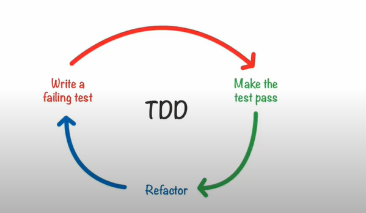

# Introdução ao teste de Software

Uma forma de aumentar a produtividade

"Teste de software é executar um programa com a inteção de encontrar erros que ele tenha. Ou o maior subconjunto de erros que o programa tenha".

Testar software desta forma é a metodologia de criar outros programas para testar o programa.

Motivações: 
* Melhorar a qualidade do software minimizando o número de erros
* Minimizar o custo de desenvolvimento e antecipar a detecção dos erros

Existem vários tipos de testes: 
* Teste de unidade:
* Teste de integração:
* Teste de sistema:
* Teste de aceitação:


### Testes de unidades: 
Verificam a corretude de unidades individuais do sistema. Um pequeno código que testas as funções e métodos. 

Basicamente um pedaço de código que testa outro pedaço de código e diz se o teste está correto

### Teste de integração: 

É a fase apos o teste unitário, em que os modulos são combinados e testados em grupos.

### Testes de sistemas: 
Englobam vários tipos de testes: 
* Teste de Segurança: Sussetivel a invasão
* Teste de Desempenho: Se o sistema é rápido o suficiente
* Teste de Escalabilidade: Se o sistema é robusto para um tráfego muito grande. 

### Teste de aceitação: 
Se o sistema atende as aceitações. Verifica se o sistema atende a sua especificação e as necessidades do usuário. As coisas que o usuário necessita, mas que não foi implementado na primeira fase. 


##  Teste de unidade

São testes mais simples em que o próprio programador pode fazer.
O Objetivo aqui é isolar acada parte do programa e mostrar as partes individuais estão funcionando corretamente.

Um caso de teste avalia a propriedade específica do módulo testado.  Caso o teste falhe, sabemos exatamente onde o erro aconteceu e onde como houve o erro.

O processo de programação por teste, acelera a qualidade de a velocidade. 


### Testes de unidade devem...
* Testar uma única unidade
* Ser curtos, facil de ler e executar rapidamente
    * Eles devem ser rápidos pois para cada alteração feita, possamos testar o que alteramos
* A ordem de execução dos testes não tem dependências um dos outros. I.E os testes devem funcionar de forma independente, a ideia que sejam individuais.
* Testar a maioria das funções publicas. (as vezes até mais de um teste por função)
* Escrever cóodigos de testes para funções mais criticas e importantes.
* Testar casos triviais e extremos.  (Os casos inesperados)
* Cobrir vários caminhos de cada função. (Por exemplo um `IF` tem 2 caminhos de execuções)


O teste unitário, permite que alterações sucessivas no código seja validadas imediatamente.

<hr>

Um problema no desenvolvimento de software é a documentação do código, pois ha um grande custo em manter o código atualizado.
Mas com o teste, facilita a documentação da função e deixa explicita o que a função deve fazer.


Os testes de unidade, facilitam os testes de integrações. Pois temos a garantia de que cada parte individual está funcionando. Assim sabemso que o erro está ao ligar 2 funções e não individualmente em uma .


### Frameworks de teste de unidade. 
Permitem que iniciantes escrevam testes mais facil e rápidos 

e que programadores seniores escrevam testes complexos de formas simplificadas. 

Exemplos de frameworks: 

● Doctest

    ○ https://github.com/onqtam/doctest
● Catch2

    ○ https://github.com/catchorg/Catch2
● GoogleTest

    ○ https://github.com/google/googletest 


Vamos usar aqui o Doctest, mas é mais simples de se utilizar. Vamos escrever testes para a função fatorial seguinte: 

<u>./fatorial.cpp</u>
```c++
# include "fatorial.h"
int fatorial (int n) {
    if (n <= 1) {
        return 1;
    } else {
        return n * fatorial(n - 1);
    }
}

```


<u>./fatorial.teste.cpp</u>
```c++
#define DOCTEST_CONFIG_IMPLEMENT_WITH_MAIN  // Faz com que o test seja implementado como uma função main.
#include "doctest.h"
#include "fatorial.h"


// Cada caso de teste é implementado por um TEST_CASE que recebe um nome de parametro.
TEST_CASE("Testando o fatorial") {
    CHECK(fatorial(2) == 2);
    CHECK(fatorial(3) == 6);
    CHECK(fatorial(4) == 24);
    CHECK(fatorial(10) == 3628800);
}
```

Como compilar: 
> $ g++ -std=c++14 fatorial.cpp fatorial.test.cpp -o teste
> $ ./teste

Mesmo se um teste falhar, ele continua e executa todos os testes citados. 


Poderiamos melhorar o código de teste, para separar em 2 casos mais especificos, como: 
<u>./fatorial.teste.cpp</u>
```c++
#define DOCTEST_CONFIG_IMPLEMENT_WITH_MAIN 
#include "doctest.h"

#include "fatorial.h"


TEST_CASE("Casos base de fatorial") {
    CHECK(fatorial(0) == 1);
    CHECK(fatorial(1) == 1);
}

TEST_CASE("Casos Gerais de fatorial") {
    CHECK(fatorial(2) == 2);
    CHECK(fatorial(3) == 6);
    CHECK(fatorial(4) == 24);
    CHECK(fatorial(10) == 3628800);
}
```


### Fases de um teste de unidade não trivial:

* Inicialização ( Onde geramos as variaveis e funções que vamos aplicar o teste)
* Execução ( Onde de fato pegamos as funções e testamos com entradas) 
* Verificação ( Aconteceu o que a função deveria ter feito ?)
* Finalização ( liberamos a memória usado nas funções que testei.)


Veja o código abaixo de exemplo: 

```c++ 
TEST_CASE("Incremento do tamanho do vetor") {
    std::vector<int> v(5);
    REQUIRE(v.size() == 5);
    REQUIRE(v.capacity() >= 5);

    // Usando o require, forçamos as condições do construtor da classe vector, para que a função push_back possa ser executada.

    v.push_back(1);

    CHECK(v.size() == 6);
    CHECK(v.capacity() >= 6 );

}
```

Qual a diferença do **Require** e **Check** ? A macro Require, quando a macro falha, o programa para, pois não faz sentido o programa continuar sem uma condição obrigatória para existência.


### Cobertura de código. 

Uma medida muito importante para entender o quanto do código está livre de erros  é a cobertura de código, que é: 
* A medida da porcentagem do código que foi executada durante os testes. Mede quantas linhas do código são executadas em testes caso todo o código for executado.

* O importante é saber se o teste passou por linhas.

* Quanto maior a cobertura, menor a chance de erros não detectados. 
* Bons testes cobrem grande parte dos fluxos possiveis de execução. 

Que seja possivel cobrir os fluxos de execuções do programa. 


### TDD (Test Drivem Development)

É um processo baseado no seguinte ciclo de desenvolvimento de software: 



Antes de uma função ser definida, deve haver um teste unitário que vai cobrir e dizer o comportamento daquela função. 

Cada test deve fazer de forma incremental do que uma função deve fazer. 

