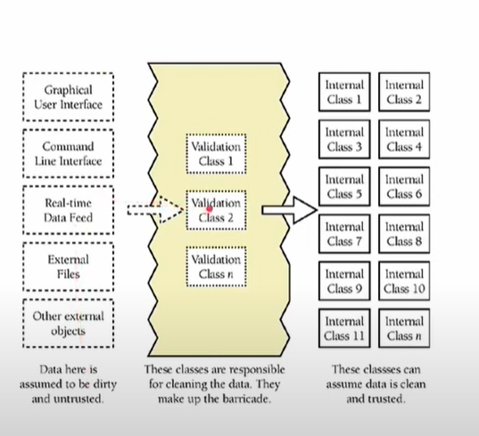

# Programação defensiva 

É basicamente escrever um programa, que é robusto para eventos inesperados que podem ocorroer. 

É o ato de conduzir de modo que mesmo com ações incorretas de outros programadores, o nosso codigo não involva acidentes: 

* Queremos evitar acidentes: 
    * Neste caso erros de execução

* Apesar de ações incorretas
    * dos usuários do sistema, que vão utilizar
* Em condições adversas
    * do ambiente que vai executar o sistema, como problemas de memoria e etc...


### Garbage In, Garbage Out

* Ignora possíveis erros externos ao programa: 
    * Entradas ruins produzem saidas ruins
    * Colocar a culpa no usuário
    * Isso leva a programas instáveis e inseguros
    * Alto custo de manutenção.

### Garbage In, Nothing Out
* Mesmo se o sistema tiver entradas ruins, nada deve acontecer 


### Garbage In, Error message Out
* Lixo entra no sistema, mas uma mensagem de erro é retornada. 

### No Garbage allowed. 
* Você projeta seu sistema de forma que nenhum dado incorreto entre no sistema.

Fazemos o **No Garbage Allowed** aplicando o princípio da robustez e da corretude: 
* **Principio da Robustez**: Consiste em sempre fazer algo que permita que o software continue operando, independente das entradas, mesmo que isso leve à alguns resultados imprecisos
* **Principio da Corretude**: Consiste em nunca retornar um resultado impreciso, não retornar nenhum resultado é melhor do que retornar um resultado incorreto;

Mas como Robustez é o oposto de Corretude, qual dos dois devemos usar ? 
* Depende do caso. 

Existem varias estratégias para fazermos e aplicarmos a programação defensiva. Exemplos: 
* Validação das entradas:
* Barricadas: 
* Asserções: 
* Tratamento de exceções:


### Validação de entradas: 
Intercepta as entradas e avalia se são válidas ou não: 
* Mas são arbitrárias, inesperadas e impevisiveis.
* Podem ser inclusive mal-intensionada.
* Devemos sempre assumir o pior de todas as entradas.

    * Definimos conjuntos de valores válidos
    * Validar a entrada com o conjunto de valores válidos
    * Implementar o que vai fazer, caso a entrada esteja incorreta.
    * A ação pode ser: Terminar/ Repetir / Alertar

### Barricadas: 
São estratégias que criam classes de validações que barram todas as entradas externas no sistema. Dessa forma impedimos que dados sujos ou corrompidos passem e sejam utilizados: 



* Minimizam o dano causado por dados incorretos
* Verificam os dados que cruzam os limites de áreas seguras
* Centralizam a verificação dos dados


AS baricadas podem ser utilizadas no contexto de uma única classe da seguinte forma: 

* Métodos Publicos: 
    * Validam os dados externos
* Métodos privados: 
    * Assumem que os dados são seguros
    * Realizam a computação


### Erros e Exceções:

* Erros são situações que nunca deveriam ter acontecido no código. O comportamento não era para ser esperado. A situação nunca deveria ter acontecido, não podem ser tratados, identificamos com o auxílio de asserções

***Asserções**: Asserções são instruçõies inseridas no código apra certificar que cada condição é verdadeira.
    * É uma expressão booleana que deve ser verdadeira naquele momento e se não for verdade, o programa é interrompido.

Exemplos de asserções usando `<cassert>`

* Parâmetro está dentro de um intervalo: 
    * O `assert(mes >= 1 && mes <=  12);`
* O ponteiro é válido: 
    * O `assert(ptr != nullptr);`
* O Container não está vazio: 
    * O `assert(! v.empty());`
* O Arquivo está aberto para leitura: 
    * O `assert(f.is_open());`


AS vantagens de utilizar asserções são: 

* Fail-Fast Programming
    * Ajudam a detectar erros precocemente
    * Análogas a fusíveis em um circuito
    * Ajudam na identificação de erros
* Ajudam na compreensão do código

* Auxiliam na implementação da programação por contrato: Précondições qque deve ser verdadeiras antes da função ser executada, poscondições apos a função ser executada, invariantes ( durante o códigos)

* É facilmente ser desabilitada os assters incluindo a seguinte linha em todos os arquivos: 

```c++
#define NDEBUG
```


## Situações Excepcionais: 
 AS vezes podem ser tratadas mesmo sem parar o sistema.
 Ocorre mesmo em códigos corretos. 
 * Falta de memória, erro na rede, erro na leitura de um arquivo

 Nesses casos fazemos uso de ferrramentes para tratamento de exceções: 


> Uma exceção é uma situação excepcional que requer uma ação específica e imediata.
> O código tem que parar apra que a exceção seja tratada. 
> O fluxo de execução do programa é interrompido e desviado para o local onde a exceção é tratada.


A utilização da exceção permite que o código seja escreito de forma a separar claramente o **fluxo normal** do **fluxo excepcional** de execução.

Exemplos: 
    * Tempo excedido de uma conexão
    * Falha na abertura de um arquivo
    * Falha na alocação na memória.
    * Acesso a um índice inválido de um vetor
    * divisão pro 0. 
    
Como tratar exceções: 

* Ignorar: É um alarme falso e continuar o fluxo.
* Reportar: Imprimir alguma mensagem de erro
* Terminar: interromper completamente a execução
* Reparar: Corrigir e prosseguir o fluxo normal de execução.


Para escrever um código robusto à Exceções, escrevemos 2 tipos de código: 
* Sinalizador:
    * identifica a ocorrência da exceção.
    * Coleta os dados relevantes para o tratamento da exceção.
    * Envia os dados para o tratador (semelhante a uma chamada de função.)
* Tratador: 
    * Corrige ou remedia as consequências da exceções.
    *  Se assemelha com uma função enviada pelo sinalizador, mas não tem um nome definido. 

* **Try**: Bloco qude código onde observa-se a eventual ocorrência de exceções

* **Throw**: 
    * Instrução que indica que ocorreu uma exceção
    * Inicializa um objeto com os dados da exceção e envia para ser tratado

* **Catch**: 
    * É o bloco tratador
    * Tem um bloco catch específico para cada tipo de exceção.
    * Responsavel pelo tratamento daquele tipo.


**EXEMPLO**:

O código abre um arquivo com idades de pessoas, exibe na tela a menor idade. 

o arquivo com idades: 
> 33 <br>
> 17 <br>
> 7 <br>
> 4 <br>
> 40 <br>
> 28<br>


código <u>./main.cpp</u>´

```c++
int main(int argc, char* argv[]) {
    // Abre o arquivo com as idades.
    ifstream fin(argv[1]);

    // Preenche o conjunto com as idades;
    set<int> conjunto;
    int idade.
    while(fin>>idade) {
        conjunto.insert(idade);
    }

    // exbie a menor idade.
    count << "Menor = " << *conjunto.begin() << endl;
    return 0;

}
```

O código acima é um programa indefeso que não leva considerações no programa. Por exemplo: 
```c++
int main(int argc, char* argv[]) {       // Numero erraod de argumentos
    // Abre o arquivo com as idades.
    ifstream fin(argv[1]); // Erro na aertura do arquivo

    // Preenche o conjunto com as idades;
    set<int> conjunto;
    int idade.
    while(fin>>idade) {  //idades inválidas
        conjunto.insert(idade);
    }

    // exbie a menor idade.
    count << "Menor = " << *conjunto.begin() << endl; //arquivo não tem elementos 
    return 0;

}
```

Formas de tratar utilizando asserts: 

```c++
int main(int argc, char* argv[]) {
    // Abre o arquivo com as idades.
    assert(argc == 2);
    ifstream fin(argv[1]);
    assert(fin.is_open());

    // Preenche o conjunto com as idades;
    set<int> conjunto;
    int idade.
    while(fin>>idade) {
        assert(idade >= 0);
        conjunto.insert(idade);
    }

    // exbie a menor idade.
    assert(!conjunto.empty());
    count << "Menor = " << *conjunto.begin() << endl;
    return 0;

}
```

O problema de utilizar  asserções, é que o programa é interrompido inesperadamente e o usuário não vai saber nem oq houve para acontecer a falha. 

Outra alternativa é utilizar `ifs`: 


```c++
int main(int argc, char* argv[]) {
    // Abre o arquivo com as idades.
    if(argc != 2) {
        cerr << "Foram Passados " << argc -1
            << "Parametros, deveria ser apenas um." << endl;
        //código que trata essa exceção
    }

    ifstream fin(argv[1]);
    
    if(!fin.is_open())) {
        cerr << "O Arquivo  " << argv[1] << "Não pode ser aberto. " << endl;
        //código que trata essa exceção
    }

    // Preenche o conjunto com as idades;
    set<int> conjunto;
    int idade.
    while(fin>>idade) {
        if (idade < 0) {
            cerr << idade << "não eh uma idade válida" << endl;
            // ... código que trata esta exceção.
        } else {
            conjunto.insert(idade);
        }
        
    }

     // Exibe a menor idade.
    if (conjunto.empty()) {
        cerr << "Nenhuma idade informada" << endl;
        // ... Código que trata esta exceção.
    } else {
        cout << "Menor = " << *conjunto.begin() << endl;
    }

    return 0;
}
```

Podemos tbm ter uma alternativa um pouco melhor com o try e catch que fazem o sistema ficar mais fluido: 

```c++
int main(int argc, char* argv[]) {
    try {
    // Abre o arquivo com as idades.
        if (argc != 2) throw 1;
        ifstream fin(argv[1]);
        if (!fin.is_open()) throw 2;
        // Preenche o conjunto com as idades.
        set<int> conjunto;
        int idade;
        while (fin >> idade) {
            if (idade < 0) throw 3;
            conjunto.insert(idade);
        }
        // Exibe a menor idade.
        if (conjunto.empty()) throw 4;
        cout << "Menor = " << *conjunto.begin() << endl;
        return 0;
    } catch (int e) {
        if (e == 1) {
            cerr << "Foram passados mais de um parametro, deveria ser apenas um. "
            << endl;
            // ... Código que trata esta exceção.
        } if (e == 2) {
            cerr << "O arquivo de entrada não pode ser aberto. " << endl;
            // ... Código que trata esta exceção.
        } if (e == 3) {
            cerr << "O arquivo contém uma idade invalida" << endl;
            // ... Código que trata esta exceção.
        } if (e == 4) {
            cerr << "Nenhuma idade informada" << endl;
            // ... Código que trata esta exceção.
        }
    }
}

```

Podemos melhorar o código mais ainda, criando structs para serem passadas ao catch:

```c++
struct ParamInvalido {
    int argc;
    char** argv;
};

struct FalhaNaAbertura {
    string arquivo;
};

struct IdadeInvalida {
    int idade;
};

struct NenhumRegistro {
};

```
Fazendo a utilização: 

```c++
int main(int argc, char* argv[]) {
    try {
    // Abre o arquivo com as idades.
        if (argc != 2) throw ParamInvalido{argc, argv};
        ifstream fin(argv[1]);
        if (!fin.is_open()) throw FalhaNaAbertura{argv[1]};
        // Preenche o conjunto com as idades.
        set<int> conjunto;
        int idade;
        while (fin >> idade) {
            if (idade < 0) throw IdadeInvalida{idade};
            conjunto.insert(idade);
        }
        // Exibe a menor idade.
        if (conjunto.empty()) throw NenhumRegistro();
        cout << "Menor = " << *conjunto.begin() << endl;
        return 0;
    } catch (ParamInvalido e) {
        cerr << " Foram Passados " << e.argc - 1 << " parametros, ... " << endl;
        // ... Código que trata esta exceção.
    } catch (FalhaNaAbertura e) {
        cerr << " O arquivo " << e.arquivo << " não pode ser aberto. " << endl;
        // ... Código que trata esta exceção.
    } catch (IdadeInvalida e) {
        cerr <<  e.idade << " não é uma idade válida " << endl;
        // ... Código que trata esta exceção.
    } catch (NenhumRegistro e) {
        cerr << "Nenhuma idade informada" << endl;
        // ... Código que trata esta exceção.
    } catch (NenhumRegistro e) {
        cerr << "Nenhuma idade informada" << endl;
        // ... Código que trata esta exceção.
    } catch(...) {
        cerr << "Erro desconhecido" << endl;
        // ... Código que trata esta exceção  genérica.
    }
        if (e == 1) {
            cerr << "Foram passados mais de um parametro, deveria ser apenas um. "
            << endl;
        } if (e == 2) {
            cerr << "O arquivo de entrada não pode ser aberto. " << endl;
            // ... Código que trata esta exceção.
        } if (e == 3) {
            cerr << "O arquivo contém uma idade invalida" << endl;
            // ... Código que trata esta exceção.
        } if (e == 4) {
            cerr << "Nenhuma idade informada" << endl;
            // ... Código que trata esta exceção.
        }
    }
}

```


Vamos para outros exemplos, como por exemplo, uma excessão lançada externamente: 

```c++ 
class VetorVazio {};

int MaiorElemento(vector<int>& q) {
    if(q.empty())
        throw VetorVazio();
    int max = q[0];
    for (int x: q) {
        if (x > max) {
            max = x;
        }
    }
    return max;
}

int main() {
    try {
        vector<int> v;
        //... Código que inicializa o vetor
        cout << MaiorElemento(v) << endl;

    } catch (VetorVazio e ) {
        cerr << "Não é possível exibir o maior elemento"
            << " de um vetor vazio." << end;
        //... Código que inicializa o vetor
    }
    return 0;

}
```

### Princiáis vantagens de utilizr Try-Throw-Catch

* Reduz o aninhamento de if-then-else
* Melhora legibilidade pois separa os fluxos do códigos.
* Exiba mensagens de erro claras e informativas
* Registre (log) as falhas para análises posteriores
* Nunca assuma nada como verdades absolutas.
* Mantenha o código o mais simples o possivel.


<br> 

* Evitar uso excessivo de PD
Tentar utilizar defesas para erros que nunca vão acontecer é um disperdício de tempo e de dinheiro.
* Pode tornar o código bem mais difícil de se ler. 

* Tente encontrar o equilibrio entre Robustez VS Corretude.