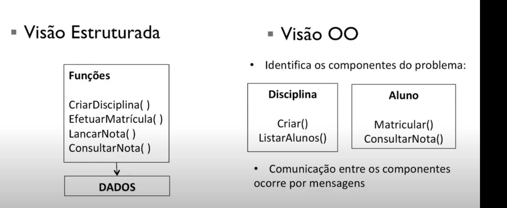
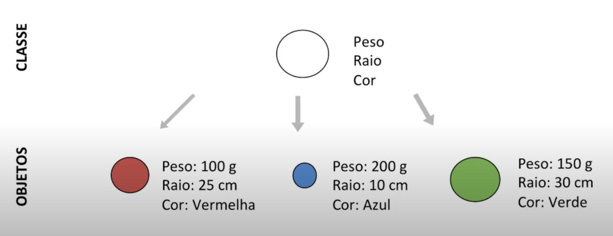
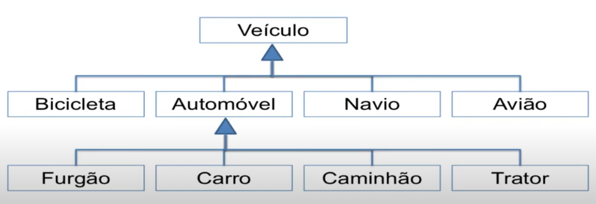

# POO (Programação Orientada à Objetos)

Linguagens em geral podem ser categorizadas em paradigmas 

Paradigma  é: 
* Origem no grego: Modelo ou padrão
* Modelo ou padrão à se seguir 

**Quando trazemos para a programação é**: Tecnicas, estruturas e conceitos utilizados para o desenvolvimentos de software

Principais paradigmos: 

* Imperativos: Vamos dizer ao computador o que ele vai fazer 

    * Procedural: C, fortran
    * OO: C++, Java

* Declarativo: baseado na avaliação de funções matematicas 
    * logica
    * funcional

### Paradigma imperativo

Um dos mais antigos,define uma sequencia de comandos que mudam o estado de um programa.

No paradigma procedural, permitimos a reusubalidade, com isso podemos dividir um grande programa em partes menores e juntar para resolver. Usando a abordagem dividir para conquistar. 

### Crise de software: 

* prazos curtos
* custos acima dos previstos
* não atendiamento dos requisitos
* Elevado custo de manutenção 


* POO, imperativo no estilo, mas adiciona características que dão suporte a objetos

* Aproxima o mundo real e o mundo virtual

* Simula o mundo real no computador utilizando objetos.


* Define objetos que si interagem


Na estrutural: 

    Estruturada são acessadas via funções, e tipos mais complexos são acessados por structs

Programação OO: 

    Os dados são dotados de certa inteligência. É importante o que ele faz e não como. 

<center></center>


### Vantagens: 

* Confiabilidade
* Reaproveitamento de código
* Facilidade de Manutenção


# Objetos e classes 

em oo organizamos o programa em termos de objetos.
Mudar a forma que pensamos
 
Devemos pensar em objetos que são equivalentes no mundo real e que eles se comunique,. 

Cada objeto tem suas **caracteristicas** e seu **comportamento**. 

Imagine o objeto **Aluno**.

* Caracteristicas(**atributo**): funciona como uma variável pertencente ao objeto.
    * Nome, curso, numero de matricula, disciplinas cursadas e etc..
* Comportamento(**método**) função ou procedimento pertencente ao objeto
    * matricular em disciplicnas, consultar notas, consultar historico escolar


Os objetos possuem dados que devem ser ocultados do "mundo externo" e serem 
acessíveis somente via métodos internos.

A classe é o tipo do objeto, por exemplo Fusca e Ferrari são da classe Carro.

A classe descreve as  caracteristicas e comportamentos de um consjunto de objetos, o objeto possuirá os atributos e métodos definidos pela classe.

o objeto é chamado de instância de sua classe. 

#### A classe é o bloco básico para a construção em OO exemplo bola: 
<br>
<center></center>

*<u>./Bola.hpp</u>*
```c++
# include <string>

class Bola {

    public: 
        float peso;
        float raio;
        string cor;

    void setPeso(float);
    float getPeso();
}
```

*<u>./Bola.cpp</u>*
```c++
# include "Bola.hpp"

void Bola::setPeso(float p) {
    peso = p;
}

float Bola::getPeso() {
    return peso;
}
```

*<u>./Main.cpp</u>*
```c++
#include <iostream>
#include "Bola.hpp"

using namespace std;

int main() {
    Bola b1; // criado estaticamente, foi para a pilha (steck)
    Bola *b2 = new Bola(); //criado dinamicamente foi para o Heap

    delete b2;
    return 0;
}
```


## Principios de Programação Orientada a Objetos

1. Abstração 
    
    * Representação computacional do objeto real deve se concentrar nas características são relevantes para o problema. 
    * Criados somentes atributos e metodos para o problema em mãos.
    * Elimine o irrelevante, enfatize o essencial

2. Encapsulamento

    * O objeto deve esconder seus dados e detalhes de sua implementação
    * O que acontece não interessa o importante é que aquilo é um objeto X.
    * Os atributos não devem ser manipulados diretamente. Somente devem ser alterados ou consultados através dos métodos do objeto.
    * Um sistema orientado a objetos baseia-se no contrato e não na implementação interna.
    Proteção da estrutura interna (integridade) : modificadores de acesso como *public*, *protected*, *private*


3. Herança
    * Aqui existe uma estrutura de hierárquica: 
    * A Classe forneceu os elementos herdados é chamado de **superclasse**
    * A classe herdeira é chamada de **subclasse**
    * A subclasse pode herdar os métodos e atributos de suas **superclasses**
    * A subclasse pode definir novos atributos e métodos específicos.
<center></center>

4. Polimorfismo:
    * do grego: Muitas formas
    * capacidade da linguagem de tratar tipos diferentes de forma homogênea
    * Uma subclasse pode redefinir (sobrescrever) um método herdado ou seja, recodficar esse método.
    
5. Modularidade: 
    * O sistema deve ser o mais coeso o possivel e fracamente acoplados. 
    * tem que guardar o maior numero o possivel de informação dentro dele e utilizarmenos componetes externos.
    * depender o minimo de outros objetos.

6. Comunicação entre objetos
    * Envio/recebimento de mensagens
    * forma de invocar um coportamento 
    * Informação contida na mensagem 


# Classes 

a classe é  bloco básico para construção de programas OO. Ela descreve um conjunto
de objetos.

**O objeto é chamado de instância de sua classe.**

Classes e structs são muito semelhantes, mas no geral structs possue apenas variaveis 
publicas. Já as classes tem muitos modificadores de acessos 

Utilizaremos apenas para casos que quizermos armazenar um conjunto de variáveis.   

Toda classe tem 4 tipos de components:
* Membros de instância 
* Membros de Classe (estáticos)
* Procedimentos de inicialização 
* Procedimentos de destruição 


### Membros de instancias
tem sempre um espaço de memoria alocado para cada objeto. Somente são chamados através do objeto. 

### Membros de  classe
Espaço de memória unico para todos os objetos daquela classe
podem até mesmo ser chamados sem um objeto.
 
#### Instanciação: 
    é a criação de um novo objeto na memoria. Alocação na memoria, ou a criação e retorno de uma referência do novo objeto 

    Todo objeto possui uma referência, utilizada para acessar seus atributos 

exemplo: 

```c++
class Ponto {
    public: 
        int: x;
        int: y;
};

int main() {
    Ponto p1; // Adotado para classes , (Stack)
    Ponto *p2 = new Ponto(); //   (Heap)

    delete p2; // Temos que limpart
    return 0;
}
```

Imagine a classe casa: 

temos 

```c++

Casa c1;
c1.numero = 77
c1.cor = "Verde";

Casa c2;
c2.numero = 55
c2.cor = "Vermelho";


Casa c3;
c2.numero = 11
c2.cor = "Amarelo";
```
Esses acima foram atributos de instância. 
Temos que lembrar de dar valores sempre que inicializarmos uma classe pois 
por padrão os valores podem vir com ponteiros para lixo.

Exemplo de inicialização: 

```c++
class Ponto { 
    public: 
        int x = 99;
        int y;
}

int main() {
    Ponto p1;
    Ponto *p2 = new Ponto();

    p1.y = 123;
    p2->y = 321;

    cout << p1.x << "\t" << p1.y << endl;
    cout << p2->x << "\t" << p2->y << endl;

    return  0;
}
```

Os atributos estaticos são declarados para toda a classe de uma vez. 

```c++
class ClasseAtributoEstatico { 
    public:
        static int numero;

        ClasseAtributoEstatico() {
            ClasseAtributoEstatico::numero++;
        }

        void imprimirNumero() {
            cout << ClasseAtributoEstatico::numero << endl;
        }
};

// A inicialização do atributo estático tem que ser feita
// no arquivo CPP. 
int ClasseAtributoEstatico::numero  = 0;
```

O que será impresso na tela ? 
```c++ 
int main() {
    ClasseAtributoEstatico c1;
    c1.imprimirNumero(); // 1
    
    ClasseAtributoEstatico c2;
    c2.imprimirNumero(); // 2

    c1.imprimirNumero(); // 2
    return 0;
}
```


#### Metodos

Os métodos são procedimentos que podem modificar ou apenas acessar os valores dos atributos  

* Na instância e na Classe. 

Eles também possuem controle de visibilidade, determinar os métodos diponíveis para o acesso. Permite definir o contrato da classe.  Relacionado ao encapsulamento da classe. 

##### Construtores 

Método chamado durante a instanciação :
* Classe declara zero ou mais construtores 
* Possui o construtor padrão sem parametros 
* devem possuir o mesmo nome da classe 
* selecionados através da lista de parametro
* nunca declarem tipo de retorno 

```c++
class Ponto {
    public: 
        int x;
        int y;
        Ponto(int x, int y) {
            this->x = x;
            this->y = y;
        }
}
```

Quando a classe possui mais de um construtor, chamamos de sobrecarga (overloading)
Seria dois ou mais metodos com o mesmo nome **Polimorfismo**

Para haver **Polimorfismo** a lista de parametro e a ordem desses metodos devem
ser diferentes para assim saber qual metodo escolherer  

Esses métodos não são diferenciáveis pelo tipo de retorno.
Podem possuir diferentes tipos de retorno <u>desde que possuam diferentes parâmetros</u>

exemplo: 

```c++
class Ponto {
    public: 
        int x;
        int y;
        
        Ponto(int x, int y) {
            this->x = x;
            this->y = y;
        }

        Ponto(int xy) {
            this->x = xy;
            this->y = xy;
        }
}
```

##### THIS ?

This é um ponteiro declarado implicitamente para uma instância específica da classe (definida pelo contexto onde o metodo é executado)

Utilizado internamente à qualquer método não estático para referenciar o objeto atual.

* exemplo de instanciação por polimorfismo


```c++
class Ponto {
    public: 
        int x;
        int y;
        
        Ponto(int x, int y) {
            this->x = x;
            this->y = y;
        }

        Ponto(int xy) {
            this->x = xy;
            this->y = xy;
        }
}
```

main.cpp
```c++
int main() {
    Ponto p1; // falaha a execução pois não á construtor sem parametro
    Ponto p2(50, 50); // usa o construtor 1
    Ponto* p3 = new Ponto(50); //usa o construtor 2

    return 0;
}
```


E se eu quiser um construtor sem parametro ? 


```c++
class Ponto {
    public: 
        int x;
        int y;

        Ponto() {
            this->x = -9;
            this->y = -9;
        }
        
        Ponto(int x, int y) {
            this->x = x;
            this->y = y;
        }

        Ponto(int xy) {
            this->x = xy;
            this->y = xy;
        }
}
```

como reduzir duplicidade de código ? 


```c++
class Ponto {
    public: 
        int x;
        int y;

        Ponto() : Ponto(-9, -9) {}

        Ponto(int xy) : Ponto(xy, xy) {}
         
        Ponto(int x, int y) {
            this->x = x;
            this->y = y;
        }
};
```


#### Destrutores 

* Métodos chamado para a finalização
    * Libera os recursos alocados na execução
    * Quando a "Vida" de um objeto chega ao fim
        * Heap -> Após um deleat
        * Stack -> Após o término da função

    * Devem Possuir o mesmo nome da Classe
    * Semelhante aos construtores 
    * Devem ser precedidos por '~'


exemplo: 

```c++
class TesObject {
    int atributo;

    public:
        TestObject(int valor): atributo(valor) {}

        ~TestObject() {
            cout << "~TestObject" << atributo << endl;
        }
};
```

main.cpp

```c++
int main() {
    TestObject o1(1);
    TestObject* o2 = new TestObject(2);

    delete(o2);
    return 0;
}
```

OUTPUT:

    ~TestObject2
    ~TestObject1

o testeObject2 vem primeiro pois foi dado o delete e o TestObject1 só é desconstruido
ao final da função.


#### Métodos estáticos 

* Resolvidos em tempo de compilação.
    * Não dinamicamente como no caso de metodos de instância que
    são resolvidos baseados no tipo do objeto em tempo de execução

* Não podem ser sobrescritos (herança)
* Dentro de métodos static só podem ser acessados atributos e métodos static! 
    Pois precisa ser também resolvido em tempo de computação.


Exemplo: 

```c++
class MathUtils {
    public: 
        static double calcularMedia(double a, double b) {
            return (a + b)/2;
        }
};

int main () {
    cout << MathUtils::calcularMedia(10,20) << endl;
    return 0;
}